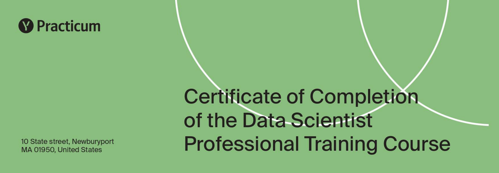

# Yandex.Practicum Data Science Projects

[EN] This repository contains projects that I completed while undergoing the "Data Science Specialist" course. Please note that all projects are executed in Russian. Feel free to use my projects for educational purposes if you are Yandex.Practicum  student. Sharing data is prohibited by security policy, therefore only projects completed in the Jupiter Notebook format are presented in the repositories.

[RUS] Проекты, выполненные за время обучения в Яндекс.Практикум по направлению "Специалист по Data Science". В проектах сохранены замечания ревьюеров, которые вы можете использовать в образовательных целях.

## Сертификат
На данный момент обучение завершено, сертификат в процессе оформления.

## Описание проектов

| № | Проект | Описание | Библиотеки |
|--|--|--|--|
|1| [Яндекс.Музыка](https://github.com/Scoundrella/ds_projects_yandex/tree/main/01_yandex_music) | Исследование поведения пользователей Яндекс.Музыки двух столиц. | `pandas` |
